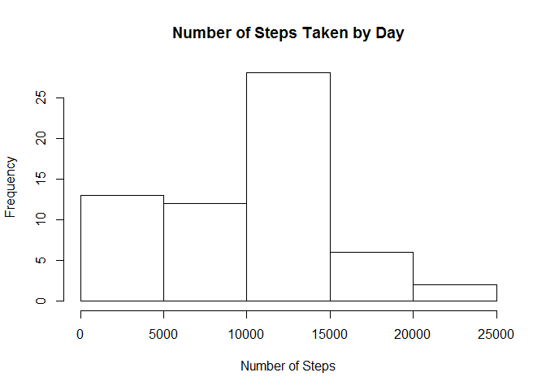
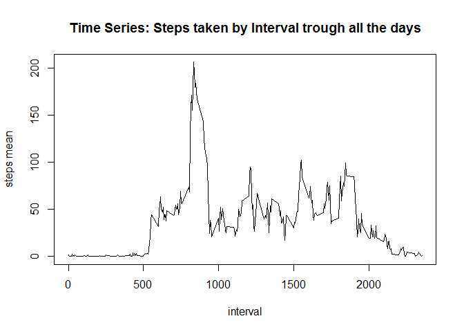
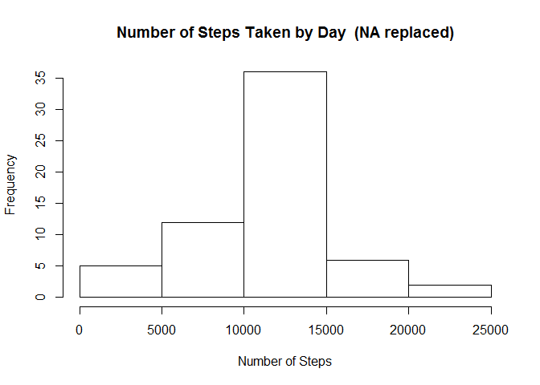
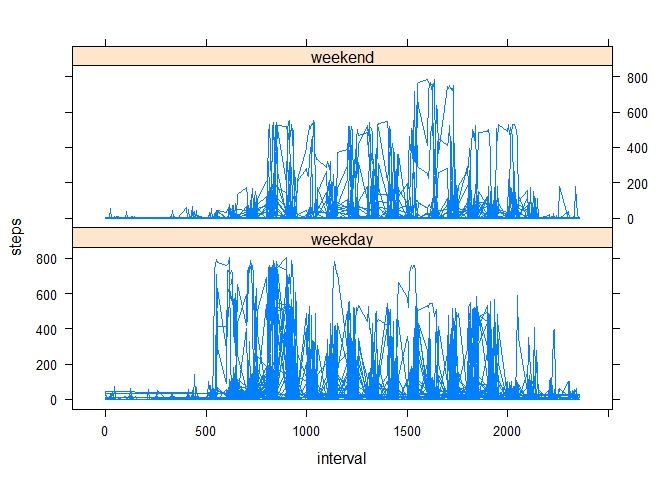

# Reproducible Research: Peer Assessment 1
warnov  
Saturday, May 16, 2015  


## Loading and preprocessing the data
This article assumes you have in your working directory the activity.zip file (from the project repository). 

First, let's load this file into memory: 


```r
data <- read.csv(unz("activity.zip", "activity.csv"))
```

## What is mean total number of steps taken per day?
To get this answer, we need to create a table out from our data, summarizing using the *sum* operation. To do this, we'll be using the **data.table** package, then we will convert our dataframe to a table and with that table, make the desired operations.


```r
library(data.table)
tdata<-data.table(data)
tdatameans<-tdata[,sum(steps, na.rm=T),by=date]
```

Now let´s give some meaningful names to our results


```r
setnames(tdatameans,names(tdatameans),c('date','stepssum'))
```

Let's print the resulting table using the **xtable** package (this article assumes the package is already installed):


```r
library(xtable)
xtdatameans<-xtable(tdatameans)
print(xtdatameans,type="html")
```

<!-- html table generated in R 3.1.2 by xtable 1.7-4 package -->
<!-- Sun May 17 15:30:39 2015 -->
<table border=1>
<tr> <th>  </th> <th> date </th> <th> stepssum </th>  </tr>
  <tr> <td align="right"> 1 </td> <td> 2012-10-01 </td> <td align="right">   0 </td> </tr>
  <tr> <td align="right"> 2 </td> <td> 2012-10-02 </td> <td align="right"> 126 </td> </tr>
  <tr> <td align="right"> 3 </td> <td> 2012-10-03 </td> <td align="right"> 11352 </td> </tr>
  <tr> <td align="right"> 4 </td> <td> 2012-10-04 </td> <td align="right"> 12116 </td> </tr>
  <tr> <td align="right"> 5 </td> <td> 2012-10-05 </td> <td align="right"> 13294 </td> </tr>
  <tr> <td align="right"> 6 </td> <td> 2012-10-06 </td> <td align="right"> 15420 </td> </tr>
  <tr> <td align="right"> 7 </td> <td> 2012-10-07 </td> <td align="right"> 11015 </td> </tr>
  <tr> <td align="right"> 8 </td> <td> 2012-10-08 </td> <td align="right">   0 </td> </tr>
  <tr> <td align="right"> 9 </td> <td> 2012-10-09 </td> <td align="right"> 12811 </td> </tr>
  <tr> <td align="right"> 10 </td> <td> 2012-10-10 </td> <td align="right"> 9900 </td> </tr>
  <tr> <td align="right"> 11 </td> <td> 2012-10-11 </td> <td align="right"> 10304 </td> </tr>
  <tr> <td align="right"> 12 </td> <td> 2012-10-12 </td> <td align="right"> 17382 </td> </tr>
  <tr> <td align="right"> 13 </td> <td> 2012-10-13 </td> <td align="right"> 12426 </td> </tr>
  <tr> <td align="right"> 14 </td> <td> 2012-10-14 </td> <td align="right"> 15098 </td> </tr>
  <tr> <td align="right"> 15 </td> <td> 2012-10-15 </td> <td align="right"> 10139 </td> </tr>
  <tr> <td align="right"> 16 </td> <td> 2012-10-16 </td> <td align="right"> 15084 </td> </tr>
  <tr> <td align="right"> 17 </td> <td> 2012-10-17 </td> <td align="right"> 13452 </td> </tr>
  <tr> <td align="right"> 18 </td> <td> 2012-10-18 </td> <td align="right"> 10056 </td> </tr>
  <tr> <td align="right"> 19 </td> <td> 2012-10-19 </td> <td align="right"> 11829 </td> </tr>
  <tr> <td align="right"> 20 </td> <td> 2012-10-20 </td> <td align="right"> 10395 </td> </tr>
  <tr> <td align="right"> 21 </td> <td> 2012-10-21 </td> <td align="right"> 8821 </td> </tr>
  <tr> <td align="right"> 22 </td> <td> 2012-10-22 </td> <td align="right"> 13460 </td> </tr>
  <tr> <td align="right"> 23 </td> <td> 2012-10-23 </td> <td align="right"> 8918 </td> </tr>
  <tr> <td align="right"> 24 </td> <td> 2012-10-24 </td> <td align="right"> 8355 </td> </tr>
  <tr> <td align="right"> 25 </td> <td> 2012-10-25 </td> <td align="right"> 2492 </td> </tr>
  <tr> <td align="right"> 26 </td> <td> 2012-10-26 </td> <td align="right"> 6778 </td> </tr>
  <tr> <td align="right"> 27 </td> <td> 2012-10-27 </td> <td align="right"> 10119 </td> </tr>
  <tr> <td align="right"> 28 </td> <td> 2012-10-28 </td> <td align="right"> 11458 </td> </tr>
  <tr> <td align="right"> 29 </td> <td> 2012-10-29 </td> <td align="right"> 5018 </td> </tr>
  <tr> <td align="right"> 30 </td> <td> 2012-10-30 </td> <td align="right"> 9819 </td> </tr>
  <tr> <td align="right"> 31 </td> <td> 2012-10-31 </td> <td align="right"> 15414 </td> </tr>
  <tr> <td align="right"> 32 </td> <td> 2012-11-01 </td> <td align="right">   0 </td> </tr>
  <tr> <td align="right"> 33 </td> <td> 2012-11-02 </td> <td align="right"> 10600 </td> </tr>
  <tr> <td align="right"> 34 </td> <td> 2012-11-03 </td> <td align="right"> 10571 </td> </tr>
  <tr> <td align="right"> 35 </td> <td> 2012-11-04 </td> <td align="right">   0 </td> </tr>
  <tr> <td align="right"> 36 </td> <td> 2012-11-05 </td> <td align="right"> 10439 </td> </tr>
  <tr> <td align="right"> 37 </td> <td> 2012-11-06 </td> <td align="right"> 8334 </td> </tr>
  <tr> <td align="right"> 38 </td> <td> 2012-11-07 </td> <td align="right"> 12883 </td> </tr>
  <tr> <td align="right"> 39 </td> <td> 2012-11-08 </td> <td align="right"> 3219 </td> </tr>
  <tr> <td align="right"> 40 </td> <td> 2012-11-09 </td> <td align="right">   0 </td> </tr>
  <tr> <td align="right"> 41 </td> <td> 2012-11-10 </td> <td align="right">   0 </td> </tr>
  <tr> <td align="right"> 42 </td> <td> 2012-11-11 </td> <td align="right"> 12608 </td> </tr>
  <tr> <td align="right"> 43 </td> <td> 2012-11-12 </td> <td align="right"> 10765 </td> </tr>
  <tr> <td align="right"> 44 </td> <td> 2012-11-13 </td> <td align="right"> 7336 </td> </tr>
  <tr> <td align="right"> 45 </td> <td> 2012-11-14 </td> <td align="right">   0 </td> </tr>
  <tr> <td align="right"> 46 </td> <td> 2012-11-15 </td> <td align="right">  41 </td> </tr>
  <tr> <td align="right"> 47 </td> <td> 2012-11-16 </td> <td align="right"> 5441 </td> </tr>
  <tr> <td align="right"> 48 </td> <td> 2012-11-17 </td> <td align="right"> 14339 </td> </tr>
  <tr> <td align="right"> 49 </td> <td> 2012-11-18 </td> <td align="right"> 15110 </td> </tr>
  <tr> <td align="right"> 50 </td> <td> 2012-11-19 </td> <td align="right"> 8841 </td> </tr>
  <tr> <td align="right"> 51 </td> <td> 2012-11-20 </td> <td align="right"> 4472 </td> </tr>
  <tr> <td align="right"> 52 </td> <td> 2012-11-21 </td> <td align="right"> 12787 </td> </tr>
  <tr> <td align="right"> 53 </td> <td> 2012-11-22 </td> <td align="right"> 20427 </td> </tr>
  <tr> <td align="right"> 54 </td> <td> 2012-11-23 </td> <td align="right"> 21194 </td> </tr>
  <tr> <td align="right"> 55 </td> <td> 2012-11-24 </td> <td align="right"> 14478 </td> </tr>
  <tr> <td align="right"> 56 </td> <td> 2012-11-25 </td> <td align="right"> 11834 </td> </tr>
  <tr> <td align="right"> 57 </td> <td> 2012-11-26 </td> <td align="right"> 11162 </td> </tr>
  <tr> <td align="right"> 58 </td> <td> 2012-11-27 </td> <td align="right"> 13646 </td> </tr>
  <tr> <td align="right"> 59 </td> <td> 2012-11-28 </td> <td align="right"> 10183 </td> </tr>
  <tr> <td align="right"> 60 </td> <td> 2012-11-29 </td> <td align="right"> 7047 </td> </tr>
  <tr> <td align="right"> 61 </td> <td> 2012-11-30 </td> <td align="right">   0 </td> </tr>
   </table>
<br>
In order to analyze how is the behavior of steps taken by day, let's see a histogram of the results:


```r
hist(tdatameans$stepssum, xlab = "Number of Steps", main = "Number of Steps Taken by Day")
```

 

Finally, we need to know the mean and median of the total number of steps taken per day:


```r
stepsmean<-mean(tdatameans$stepssum)
stepsmedian<-median(tdatameans$stepssum)
```

With that beign said, the mean for the total steps taken by day is **9354.23** while the median will be **10395**

## What is the average daily activity pattern?
This time we are going to need to create a table grouping our data by intervals averaging the amount of steps taken at each interval, across all days:


```r
tdatameans<-tdata[,mean(steps, na.rm=T),by=interval]
setnames(tdatameans,names(tdatameans),c('interval','stepsmean'))
```

And now with this dataset, we can make a time series plot:


```r
plot(x = tdatameans$interval, y=tdatameans$stepsmean, main='Time Series: Steps taken by Interval trough all the days', xlab="interval", ylab="steps mean", type="l")
```

 

As we need to know which is the interval with the maximum number of steps taken on average across all the days, we need to execute this code:


```r
maxscore<-tdatameans[tdatameans$stepsmean==max(tdatameans$stepsmean)]
```

In this way, we can conclude that the 5-minute interval that on average across all the days in the dataset, contains the maximum number of steps is the number **835** with an average of **206.17**

## Imputing missing values
Now we are going to make some studies but this time NA values are going to be replaced with the value of the mean of steps for that interval.

First let's find out how many NA values are in the data.


```r
nacount<-length(tdata$steps[is.na(tdata$steps)])
```

So, now that we now that we have **2304** NA values, let's get rid of them by replacing them with the mean of steps for the interval they are appearing. For this, we are going to execute this script:


```r
#Let's copy our current data to a new dataset inr order to replace NAs
tdatanotna<-tdata 
#Iterating over the dataset, looking for NAs
for(i in 1:dim(tdatanotna)[1]){
  #If the element in the "i" position is NA, then we procede to replace it
  if(is.na(tdatanotna$steps[i])){  
    #Finding the interval corresponding to this NA value
    ival<-tdatanotna$interval[i]
    #We look for the steps mean for the interval found
    stepmean<-tdatameans[tdatameans$interval==ival]$stepsmean   
    #Replacing the NA value with the recent found steps mean value
    tdatanotna$steps[i]<-stepmean
  }
}
```

If we repeat the first experiment of calculating the mean and median of the total of steps made each day, we could find some differences:


```r
tdatasum<-tdatanotna[,sum(steps),by=date]
setnames(tdatasum,names(tdatasum),c('date','stepssum'))
```

In order to analyze how is the behavior of steps taken by day with the NA values replaced, let's see a histogram of the results:


```r
hist(tdatasum$stepssum, xlab = "Number of Steps", main = "Number of Steps Taken by Day  (NA replaced)")
```

 

Finally, we need to know the mean and median of the total number of steps taken per day now that we don't have NA values:


```r
stepsmean<-mean(tdatasum$stepssum)
stepsmedian<-median(tdatasum$stepssum)
#Removing scientific notation
options(scipen=999)  
```

With that beign said, the mean for the total steps taken by day is **10766.19** while the median will be **10766.19**

As we can see, replacing the NA values have gave us a *normal distribution* of the data in which the mean and the median have the same value.

## Are there differences in activity patterns between weekdays and weekends?

For this part the *weekdays()* function was used as well as the dataset with the filled-in missing values.

We created a new factor variable in the dataset with two levels: "weekday" and "weekend". For this we had to rename the values from FALSE to TRUE wince we used the function weekdays to get the name of the days represented by the dates in the data:


```r
#Lattice used for the panel plot
library(lattice)
#We have to convert the column date from factor to date
#in order to apply weekdays function
tdatanotna$date<-as.Date(tdatanotna$date)
#Adding the weekend column using the weekdays function and
#evaluating if the day name is one of the weekend day names
tdatanotna[,weekend:=factor(weekdays(tdatanotna$date)=="Saturday" | weekdays(tdatanotna$date)=="Sunday")]
```

```
##            steps       date interval weekend
##     1: 1.7169811 2012-10-01        0   FALSE
##     2: 0.3396226 2012-10-01        5   FALSE
##     3: 0.1320755 2012-10-01       10   FALSE
##     4: 0.1509434 2012-10-01       15   FALSE
##     5: 0.0754717 2012-10-01       20   FALSE
##    ---                                      
## 17564: 4.6981132 2012-11-30     2335   FALSE
## 17565: 3.3018868 2012-11-30     2340   FALSE
## 17566: 0.6415094 2012-11-30     2345   FALSE
## 17567: 0.2264151 2012-11-30     2350   FALSE
## 17568: 1.0754717 2012-11-30     2355   FALSE
```

```r
#Here we change the levels of the factors since we don't need true and false
#but weekend and weekday
levels(tdatanotna$weekend)[levels(tdatanotna$weekend)=="TRUE"] <- "weekend"
levels(tdatanotna$weekend)[levels(tdatanotna$weekend)=="FALSE"] <- "weekday"
#We make the plot to see the differences between patterns on wekdays and weekend
xyplot( steps ~ interval | factor(weekend), data=tdatanotna, type = "l", layout=c(1,2))
```

 

So, we can conclude that on weekends the most step activity is done on the last measured intervals while on weekdays, more steps are taken at the first intervals.
